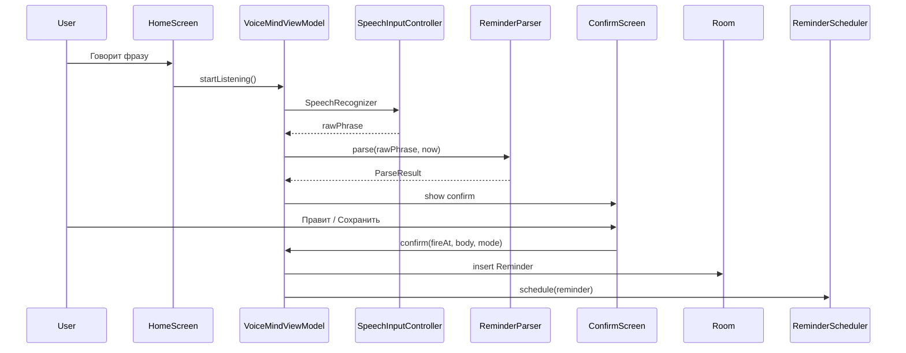

# Архитектура VoiceMind

> Дата: 2026-05-17 · Напоминалка с голосовым парсингом

## Поддерживаемые версии Android

| Параметр | Значение | Зачем |
|----------|----------|--------|
| `minSdk` | **26** (Android 8.0) | Установка на старые телефоны; каналы уведомлений из коробки |
| `targetSdk` | 36 | Требования Google Play, новое поведение разрешений |
| `compileSdk` | 36 | Сборка против актуальных API |

GymProgress с `minSdk 29` **не ставится** на Android 9 и ниже — здесь порог ниже.

При реализации alarm/уведомлений — ветки по API (`SCHEDULE_EXACT_ALARM` с 31, `POST_NOTIFICATIONS` с 33), не поднимать `minSdk` без причины.

## Модули

```
:root
└── :app
```

## Пакеты

```
com.example.voicemind/
├── MainActivity.kt
├── data/
│   ├── AppDatabase.kt
│   ├── Reminder.kt
│   ├── ReminderDao.kt
│   ├── SettingsRepository.kt
│   ├── parse/
│   │   ├── ReminderParser.kt
│   │   ├── DateTimePatterns.kt
│   │   └── ParseResult.kt
│   ├── speech/
│   │   └── SpeechInputController.kt
│   ├── scheduling/
│   │   ├── ReminderScheduler.kt
│   │   ├── ReminderAlarmReceiver.kt
│   │   ├── ReminderActionReceiver.kt
│   │   └── BootReceiver.kt
│   ├── notification/
│   │   ├── ReminderNotifier.kt
│   │   └── NotificationChannels.kt
│   └── backup/                    # фаза 5
│       └── BackupRepository.kt
├── viewmodel/
│   └── VoiceMindViewModel.kt
└── ui/
    ├── navigation/
    ├── screens/
    │   ├── HomeScreen.kt          # микрофон + ближайшее
    │   ├── ConfirmReminderScreen.kt
    │   ├── ReminderListScreen.kt
    │   ├── ReminderDetailScreen.kt
    │   └── SettingsScreen.kt
    ├── components/
    │   ├── MicButton.kt
    │   ├── ReminderCard.kt
    │   └── DeliveryModePicker.kt
    └── theme/
```

Каталоги `data/parse`, `data/speech`, `data/scheduling`, `data/notification` — в репозитории (см. FOLDER_STRUCTURE).

## Поток создания напоминания



## VoiceMindViewModel

**StateFlow:**

- `upcomingReminders` — из DAO `fireAt ASC` где `status = SCHEDULED`
- `historyReminders` — `FIRED | DISMISSED | CANCELLED`, `fireAt DESC`
- `nextReminder` — первый из upcoming
- `listeningState` — Idle / Listening / Processing
- `pendingParse` — для Confirm overlay
- `settings`
- `errorMessage`

**Методы:**

- `startListening()` / `stopListening()` / `parseText(String)`
- `confirmReminder(...)` — insert + schedule
- `snoozeReminder(id, minutes)` / `dismissReminder(id)` / `cancelReminder(id)`
- `safeDb { }` — как в GymProgress

Бизнес-логику парсинга **не** держать в Composable.

## Навигация

| Таб | Экран |
|-----|--------|
| Главная | `HomeScreen` — микрофон, ближайшее напоминание |
| Список | `ReminderListScreen` — предстоящие / история |
| Настройки | `SettingsScreen` |

Overlay:

- `ConfirmReminderScreen` — после STT/ввода
- `ReminderDetailScreen` — просмотр/редактирование/отмена

Паттерн overlay + `BackHandler` — как GymProgress.

## ReminderScheduler

```kotlin
interface ReminderScheduler {
    fun schedule(reminder: Reminder)
    fun cancel(reminderId: Long)
    fun rescheduleAll() // после boot и restore backup
}
```

Реализация: `AlarmManagerReminderScheduler` — единственное место работы с `AlarmManager`.

При update напоминания: `cancel` + `schedule` с новым `fireAt`.

## Сортировка списков

| Список | ORDER BY |
|--------|----------|
| Предстоящие | `fireAt ASC, id ASC` |
| История | `fireAt DESC, id DESC` |

## Room

- DB: `voice_mind_db`, v1: таблица `reminders`.
- Индекс: `(fireAt)`, `(status)`.
- Миграции явные; destructive только debug.

## STT

`SpeechInputController`:

- обёртка над `SpeechRecognizer`;
- поток результатов в ViewModel;
- обработка ошибок (нет сети для offline-движка не должно ломать — on-device);
- timeout 30 с.

Аудио на диск **не пишем** в MVP.

## Парсер

- `ReminderParser` — без Android SDK, тесты в `test/`.
- Зависимость от `Clock` / передаваемого `Instant now` для тестов.

## Уведомления

`ReminderNotifier.show(reminder, mode)`:

- строит `NotificationCompat` по mode;
- для `ALARM` — `fullScreenIntent` на `AlarmActivity` (фаза 4).

## Референс GymProgress (только код)

| Брать | Не брать |
|-------|----------|
| `safeDb`, StateFlow, один ViewModel | Экраны журнала тренировок |
| `version.properties`, gradle structure | IRON CORE / Volt UI |
| overlay navigation | Scoring, exercises, Room schema |
| DataStore для настроек | OpenRouter для «тренера» |

## Тестирование

| Уровень | Что |
|---------|-----|
| Unit | `ReminderParser`, `ImportMerger` (позже) |
| Unit | `ReminderScheduler` с fake AlarmManager (robolectric опционально) |
| Instrumented | DAO, receiver + reschedule |
| Manual | reboot, snooze, exact alarm permission denied |

## Связанные документы

- [REMINDER_PARSING.md](REMINDER_PARSING.md)
- [NOTIFICATION_MODES.md](NOTIFICATION_MODES.md)
- [FEATURE_PLAN.md](FEATURE_PLAN.md)
